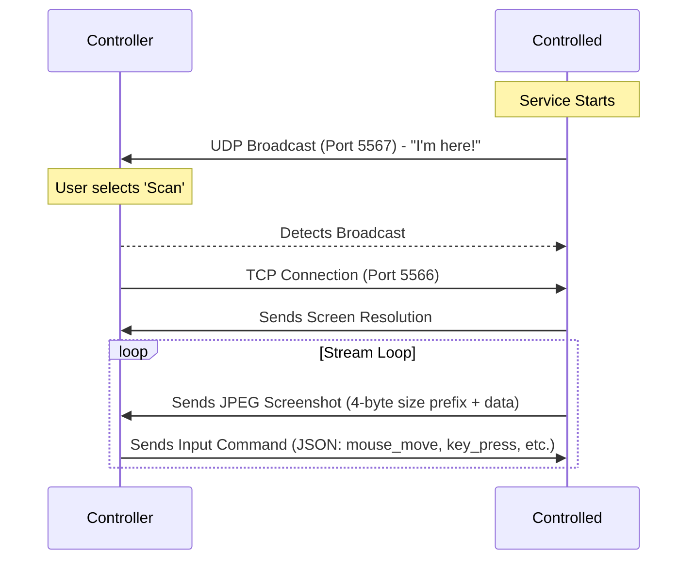

# Remote Control System

A lightweight, Python-based remote desktop and control utility. This project allows you to view and control a remote Windows machine over a local network or the internet.

## 🏗️ Architecture Overview

The system consists of two main components:

1. **The Controlled Machine (`controlled.py`)**: Runs in the background, streams the screen, and executes received mouse/keyboard commands.
2. **The Controller (`controller.py`)**: Connects to the controlled machine, displays the live feed, and captures user input to send back.



## 🚀 Features

- **Zero-Config Discovery**: Automatically finds controlled machines on the local network using UDP broadcasting.
- **Background Operation**: The controlled side runs with no window or taskbar icon.
- **Input Sync**: Supports mouse movement, clicking, and keyboard inputs (including Enter, Backspace, and Tab).
- **Optimized Streaming**: Uses JPEG compression and packet sizing for smooth performance.

## ⚙️ Installation & Setup

### 1. Prerequisites

Ensure you have Python 3.10+ installed. Install the required dependencies:

```bash
pip install -r requirements.txt
```

### 2. Setting up the Controlled Machine

Run the script directly or compile it to a background EXE:

**Run Script:**

```bash
python controlled.py
```

**Compile to EXE (No Console/Window):**

```bash
python -m PyInstaller controlled.spec
```

The resulting `controlled.exe` will be in the `dist/` folder.

### 3. Running the Controller

Run the controller on the machine you want to control from:

```bash
python controller.py
```

- **Option 1 (Scan)**: Automatically detects machines on your local network.
- **Option 2 (Manual)**: Enter an IP address manually (useful for remote control over the internet).

---

## 🔍 Deep Dive: How the Code Works

### 1. The "Packet" Logic (`receive_all`)

In network programming, sockets don't always deliver a full message in one piece. We use a 4-byte "size prefix" before every piece of data.

```python
def receive_all(sock, n):
    data = b''
    while len(data) < n:
        packet = sock.recv(n - len(data))
        if not packet: return None
        data += packet
    return data
```

- **Why?** It ensures the receiver knows exactly how many bytes to wait for (e.g., a 50KB image) before trying to process it.

### 2. UDP Discovery Discovery

Instead of typing IPs, the `controlled` side yells its name to everyone on the network.

```python
# Controlled side
broadcast_socket.sendto(msg, ('<broadcast>', 5567))

# Controller side
discovery_socket.bind(('', 5567))
data, addr = discovery_socket.recvfrom(1024)
```

- **Port 5567** is dedicated to "handshaking," while **Port 5566** handles the heavy lifting (video/commands).

### 3. Threading Strategy

The `controlled` machine uses three threads simultaneously:

- **Main Thread**: Keeps the service alive.
- **Discovery Thread**: Handles UDP broadcasting.
- **Server Thread**: Manages the TCP connection, spawning sub-threads for sending screen data and receiving commands at the same time.

### 4. Input Mapping

OpenCV uses different integer codes for keys than PyAutoGUI. We bridge that gap in the controller:

```python
if key == 13: # Enter key code
    key_val = 'enter'
else:
    key_val = chr(key)
```

This ensures that when you press "Enter" on the controller, the remote machine actually executes an "Enter" command.
